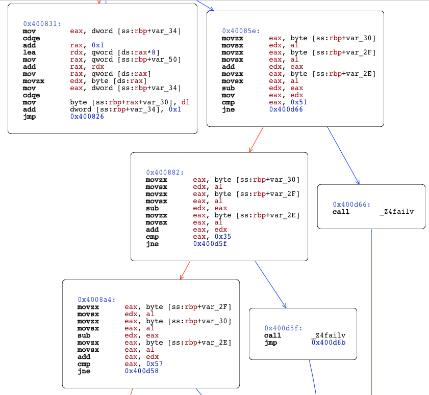

# No Calm
#### wparks

This is a straightforward reversing problem. The program asks for a large number
of command line arguments, each one a single byte. It then performs checks on them,
three characters at a time. Here is the first check in Hopper.



The program only checks 3 bytes at a time, and performs the same calculations,
only requiring different results for each one. This checks were solved
using z3, giving us the flag.

```python
from z3 import *

def solve(a1, a2, a3):
    a = Int('a')
    b = Int('b')
    c = Int('c')
    s = Solver()
    s.add(b + a - c == a1)
    s.add(a - b + c == a2)
    s.add(b - a + c == a3)
    assert s.check() == sat
    m = s.model()
    return chr(m[a].as_long()) + chr(m[b].as_long()) + chr(m[c].as_long())

res = solve(81, 53, 87)
res += solve(90, 156, 66)
res += solve(98, 140, 92)
res += solve(38, 170, 60)
res += solve(29, 161, 69)
res += solve(163, 27, 69)
res += solve(147, 43, 59)
res += solve(146, 86, 44)
res += solve(67, 89, 75)
res += solve(117, 125, 125)

print res
```
